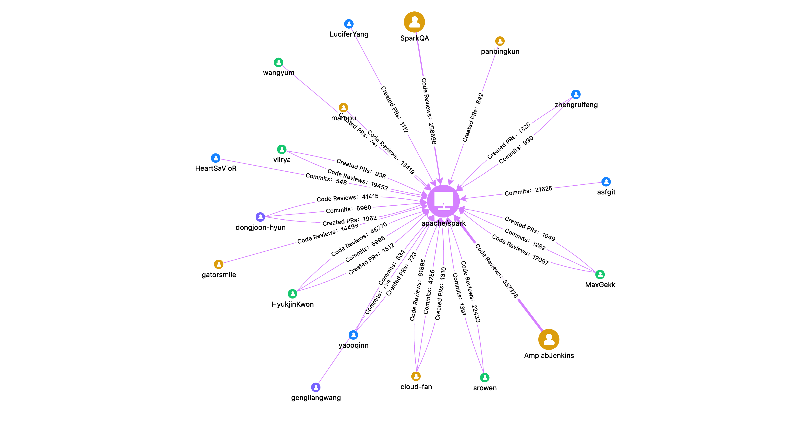
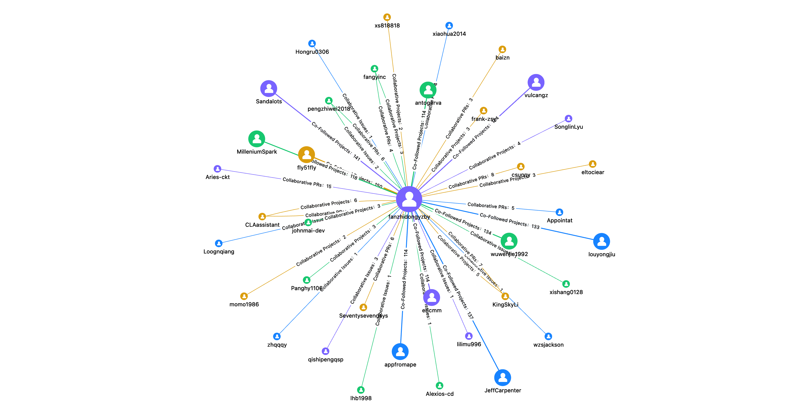
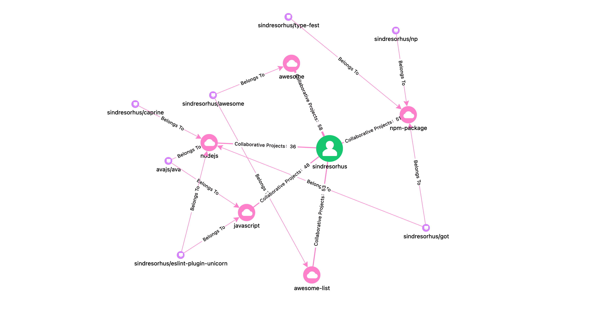

# OSGraph

> 🌐️ English | [中文](README.md)

**OSGraph (Open Source Graph)** is an open-source graph-based analytics tool that leverages the comprehensive graph of GitHub open-source data to provide insights into developer behavior and project community ecosystems. It offers developers, project owners, DevRel advocate, and community operators a clear and intuitive view of open-source data, helping you and your project to create a personalized open-source business card, find compatible development partners, and unearth deep community value.

## Website

[https://osgraph.com](https://osgraph.com)

## Features

The current product defaults to offering 6 open-source graphs for everyone to experience, which include 3 project-type graphs (Contributions, Ecosystem, Community) and 3 developer-type graphs (Activities, Partners, Interests).

### Project Contribution Graph

**Discover core project contributors**: Identify core contributors based on project development activities (Issues, PRs, Commits, CRs, etc.).

**Q**: Who are the people who have coded for the Apache Spark project?

**A**: Choose "Project Contribution Graph" - Search for spark - Select apache/spark. You would see core contributors such as HyukjinKwon and dongjoon-hyun, and you might accidentally spot two conspicuous robot accounts, AmplabJenkins and SparkQA, which only participate in CodeReview.

### Project Ecosystem Graph

**Insight into project ecosystem partners**: Extract inter-project development activities, organizations, and other related information to construct the core ecosystem relationships of the project.

**Q**: What does the surrounding ecosystem of the recently popular open-source large model Llama3 look like?

**A**: Choose "Project Ecosystem Graph" - Search for llama3 - Select meta-llama3/llama3. You would notice renowned AI projects such as pytorch, tensorflow, and transformers, as well as llama.cpp which has hit tech headlines. A surprising discovery is that ray has quite a few common developers with llama3, which could be worth a deeper investigation.

### Project Community Graph

**Analyze the distribution of the project community**: Extract core developers' community distribution based on project development activities and developer organizations.

**Q**: What is the current state of the community after many years of development of the big data engine Flink?

**A**: Choose "Project Community Graph" - Search for flink - Select apache/flink. You would observe that the main followers of the project come from China, the US, and Germany, and that the Alibaba organization is a mainstay in code contributions.

### Developer Activity Graph

**Showcasing individual open-source contributions**: Find core projects participated in based on developer development activities (Issues, PRs, Commits, CRs, etc.).

**Q**: What open-source projects has Linus Torvalds been involved in recently?

**A**: Choose "Developer Activity Graph" - Search for torvalds. As expected, the linux project is Torvalds' main focus, but he's also been involved in llvm, mody, libgit2, and has made substantial contributions to the "subsurface", a dive log management tool, showcasing his wide range of hobbies.

### Open-source Partner Graph

**Finding open-source partners**: Find other developers in the open-source community who collaborate closely with you.

**Q**: I want to know if there are people in the open-source community who share my passion?

**A**: Choose "Open-source Partner Graph" - Search for my ID. I'm shocked that so many strangers have followed the same projects as me – there could be new friends worth meeting. Those co-PR collaborators are mostly friends and colleagues I'm familiar with, but it's worth exploring the open-source partners of friends. This is how you come across the "six degrees of connection" in the open-source community.

### Open-source Interest Graph

**Discover individual open-source interests**: Analyze the developer's technical domain and interests based on the themes and tags of the projects participated in.

**Q**: What kind of technology is GitHub's most active developer interested in?

**A**: Choose "Open-source Interest Graph" - Search for sindresorhus ([GitHub User Ranking](https://gitstar-ranking.com) No.1). Overall, sindresorhus shows a keen interest in node, npm, js, and furthermore, his initiated awesome project holds an impressive 300k stars – truly jaw-dropping! Currently, the open-source interest data mainly comes from the project's limited tag information, but we may see better presentations facilitated by AI technology in the future.

## Plans

OSGraph will be enhanced with more exciting graphs and features:

* Simple, flexible API design for limitless graph extensions.
* Free, efficient canvas interaction for infinite exploration of data value.
* Graph URLs can be embedded in Markdown for creating personalized open-source business cards.
* AI-based analysis of project theme tags.
* Combined analysis of multiple people and projects to facilitate insights accessible with a single click.
* Richer data display and multi-dimensional analysis.
* **Many more features to build together with you...**

We welcome everyone to submit Issues for active discussions, offering product suggestions, and feedback on user experience.

## Contribution

The product's open-source code is actively being organized and will be available soon...

## Contacts

## Acknowledgments

A heartfelt thanks to the organizations [X-Lab](https://github.com/X-lab2017?language=shell), [AntV](https://antv.antgroup.com/), and [TuGraph](https://www.tugraph.tech/) for their strong support of this project!