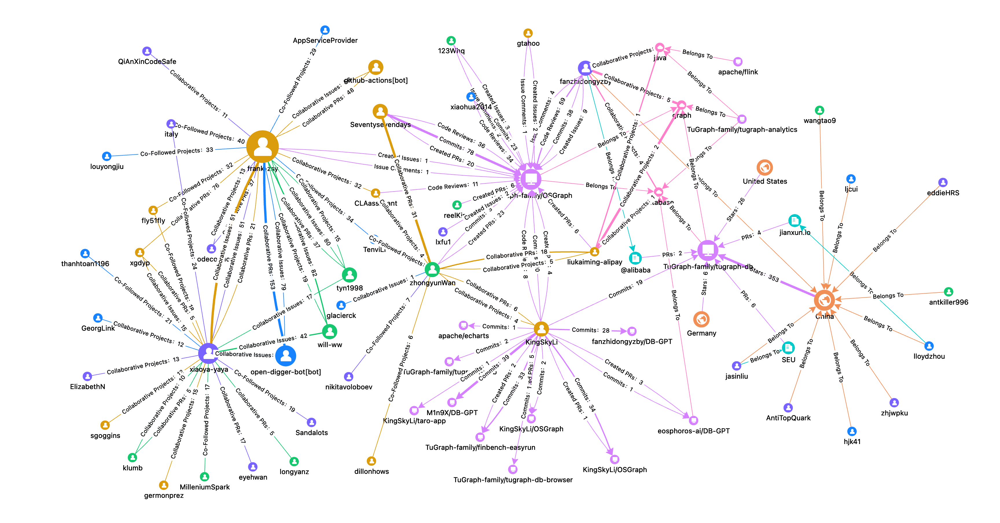

> 🌐️ English | [中文](README-cn.md)

**OSGraph (Open Source Graph)** is an open-source graph-based analytics tool that leverages the comprehensive graph of GitHub open-source data to provide insights into developer behavior and project community ecosystems. It offers developers, project owners, DevRel advocate, and community operators a clear and intuitive view of open-source data, helping you and your project to create a personalized open-source business card, find compatible development partners, and unearth deep community value.



> **OSGraph v2.0.0 New Features !!!**
> 1. Open source graph supports parameterized form configuration, making graph visualization more flexible.
> 2. Backend service refactored completed, fully embracing the Python stack.
> 3. Support multi-hop graph expansion, enabling unlimited drill-down insights into open-source data.
> 4. Support PNG url of graph, enabling one-click embedding in Markdown.
> 5. Easier graph customization, directly connecting to production.
> 6. Internationalization support.

## Website

**[https://osgraph.com](https://osgraph.com)**

## QuickStart

The following are the meanings of the 6 default basic open source graphs currently provided by OSGraph:

| Graph Name | Graph ID | Function |
|----------|------------------------|-----------------------------------------------|
| Project Contribution Graph | `project-contribution` | Find core project contributors based on developer activity information (Issues, PRs, Commits, CRs, etc.). |
| Project Ecosystem Graph | `project-ecosystem` | Extract relationships between projects' development activities and organizations to build core project ecosystem relationships. |
| Project Community Graph | `project-community` | Extract core developer community distribution based on project development activities and developer organization information. |
| Developer Activity Graph | `developer-activity` | Find core projects participated in based on developer activity information (Issues, PRs, Commits, CRs, etc.). |
| Open Source Partner Graph | `os-partner` | Find other developers who collaborate closely with the developer in the open source community. |
| Open Source Interest Graph | `os-interest` | Analyze developer's technical domains and interests based on participated project topics, tags and other information. |

You can refer to [Graph Demo](docs/en-US/demo.md) for product experience.

Want to directly embed OSGraph graphs in Markdown? Try:

```markdown

```

For more details：[OSGraph API Reference](docs/en-US/api-reference.md)

Startup and test on local machine: [Quick Start](docs/en-US/quick-start.md)

Customize your own graph (DIY): [Developer Manual](docs/en-US/developer-manual.md)

## Plans

OSGraph will be enhanced with more exciting graphs and features:

* Canvas interaction optimization for more convenient multi-graph operations.
* Multi-user and multi-project joint analysis with one-click graph access. 
* Richer data visualization and multi-dimensional analysis.
* Building LUI (Language User Interface) for intelligent insights.
* More graph data and graph feature enhancement.
* ...

We welcome everyone to submit Issues for active discussions, offering product suggestions, and feedback on user experience.

## Contribution

You can reference [Contributing](community/CONTRIBUTING.md) document and submit GitHub Issues/PRs to provide feedback and suggest improvements for OSGraph, or you can join the TuGraph community group and communicate with us directly through the contact information provided below.

## Contacts


## Acknowledgments

A heartfelt thanks to the organizations [X-Lab](https://github.com/X-lab2017?language=shell), [AntV](https://antv.antgroup.com/), and [TuGraph](https://www.tugraph.tech/) for their strong support of this project!

Also, thanks to all the individual developers who have contributed to this repository, which are listed below.

<a href="https://github.com/TuGraph-family/osgraph/graphs/contributors">
  
</a>

Made with [contrib.rocks](https://contrib.rocks).