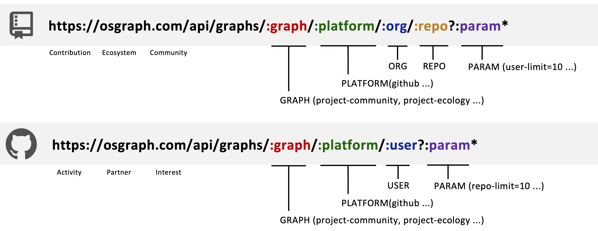

## 1. Introduction
**OSGraph (Open Source Graph)** provides six open-source data graphs by default for you to experience, including three project-related graphs (Contributions, Ecosystem, Community) and three development-related graphs (Activities, Partners, Interests). If these six graphs do not meet your needs, you can also customize your own graph based on this documentation.

## 2. Local Startup
Please refer to the [Quick Start ](QuickStart.md) document to complete the local OSGraph service startup test.

## 3. Project Structure
* Startup File: osgraph-service/run.py
* Initialization Entry: osgraph-service/app/__init__.py
* Routes (APIs): osgraph-service/app/routes
* Business Views: osgraph-service/app/managers
* Business Services: osgraph-service/app/service
* Database Connection: osgraph-service/app/dal

## 4. Detailed Development

### 4.1 API

#### 4.1.1 Specifications

* Standard Structure:


* API Example:

"Project Contribution" Graph:

https://osgraph.com/api/graphs/project-contribution/github/TuGraph-family/tugraph-site?start-time=1&end-time=1733717926&repo-limit=10

#### 4.1.2 Developing APIs
Create an API file in the osgraph-service/app/routes directory.

Develop the API content and specify the related manager.

```Python
# url_prefix
os_interest_bp = Blueprint("os_interest", __name__, url_prefix="/api/graphs")
logger = logging.getLogger(__name__)

# api
@os_interest_bp.route("/os-interest/<platform>/<path:remaining_path>", methods=["GET"])
def get_os_interest(platform, remaining_path):
    data = request.args.to_dict()
    data["platform"]=platform
    data["path"]=remaining_path
    response = controller.get_interest_graph(data)
```

### 4.2 Views

#### 4.2.1 View Models

Vertex Model
| Class Name | Attributes | Description |
| --- | --- | --- |
| `Vertex` | `id` | Unique identifier of the vertex |
|  | `name` | Name of the vertex |
|  | `comment` (optional) | Comment of the vertex |
|  | `source` (optional) | Source of the vertex |
|  | `size` (optional) | Size of the vertex |
|  | `vertex_type` | Type of the vertex (class name) |
|  | `to_dict` | Method to convert the vertex to a dictionary |

| Subclass | Inherits From |
| --- | --- |
| `User` | `Vertex` |
| `Repo` | `Vertex` |
| `Orgnization` | `Vertex` |
| `Country` | `Vertex` |
| `Company` | `Vertex` |
| `Topic` | `Vertex` |
| `Contibution` | `Vertex` |
| `PR` | `Contibution` |
| `Issue` | `Contibution` |
| `Comment` | `Contibution` |
| `CodeReview` | `Comment` |
| `Commit` | `Contibution` |

Edge Model
| Class Name | Attributes | Description |
| --- | --- | --- |
| `Edge` | `source` | Source node of the edge |
|  | `target` | Target node of the edge |
|  | `id` | Unique identifier of the edge |
|  | `name` | Name of the edge |
|  | `name_en` | English name of the edge |
|  | `direction` (default: "out") | Direction of the edge（"both", "out", "in"） |
|  | `comment` (optional) | Comment of the edge |
|  | `weight` (optional) | Weight of the edge |
|  | `count` (optional) | Count of the edge |
|  | `edge_type` | Type of the edge (class name) |
|  | `to_dict` | Method to convert the edge to a dictionary |

| Subclass | Inherits From | Default Values |
| --- | --- | --- |
| `Create` | `Edge` | `name="创建", name_en="Create"` |
| `CreatePR` | `Edge` | `name="创建 PR", name_en="Create PR"` |
| `CreateIssue` | `Edge` | `name="创建 Issue", name_en="Create Issue"` |
| `CreateCommit` | `Edge` | `name="创建 Commit", name_en="Create Commit"` |
| `CreateComment` | `Edge` | `name="创建 Comment", name_en="Create Comment"` |
| `CreateCR` | `Edge` | `name="创建 CR", name_en="Create CR"` |
| `CodeReviewAction` | `Edge` | `name="CR", name_en="CR"` |
| `Belong` | `Edge` | `name="属于", name_en="Belong"` |
| `Star` | `Edge` | `name="Star", name_en="Star"` |
| `PullRequestAction` | `Edge` | `name="PR", name_en="PR"` |
| `Push` | `Edge` | `name="推送", name_en="Push"` |
| `OpenPR` | `Edge` | `name="推送 PR", name_en="Open PR"` |
| `CommitAction` | `Edge` | `name="提交", name_en="Commite"` |
| `CommentIssue` | `Edge` | `name="评论 Issue", name_en="Comment Issue"` |
| `CommonIssue` | `Edge` | `name="合作 Issue", name_en="Common Issue"` |
| `CommonPR` | `Edge` | `name="合作 PR", name_en="Common PR"` |
| `CommonStar` | `Edge` | `name="共同关注", name_en="Common Star"` |
| `CommonRepo` | `Edge` | `name="合作项目", name_en="Common Repo"` |
| `CommonDevelop` | `Edge` | `name="共建", name_en="Common Develop"` |
| `ContributeRepo` | `Edge` | `name="贡献项目", name_en="Contribute Repo"` |

#### 4.2.2 Building Views

* Create a file in the osgraph-service/app/managers directory.

* Call the relevant service, fetch the data, and build the view.

```python
# Call the service and fetch the data
service = OSInterestService()
result = service.execute(data=data)
```

```python
# Parse the data and build the view
graph = Graph()
if start_node["type"] == "github_user":
    user = User(id=start_node["id"], name=start_node["properties"]["name"])
    graph.insert_entity(user)
if relationship["type"] == "repo":
    contribute_repo = ContributeRepo(
        source=relationship["src"],
        target=relationship["dst"],
        id=relationship["id"],
        count=relationship["properties"]["count"],
    )
    graph.insert_relationship(contribute_repo)
```

### Graph Services

#### Developing Services

* Create the corresponding service file in the osgraph-service/app/services/graph_services directory.

* Define the service parameters.

```Python
class OSInterestServiceConfig(ServiceConfig):
    def __init__(self):
        super().__init__(
            name="开源兴趣",
            comment="这是一张开源兴趣图谱",
            inputTypes=["GitHubUser"],
            filterKeys=[
                FilterKey(key="topic-topn", type="int", default=50, required=False),
                FilterKey(
                    key="githubrepo-topn", type="int", default=50, required=False
                ),
            ],
        )
```

* Register the service.

```Python
from app.services.graph_services.os_interest import OSInterestServiceConfig

SERVICE_CONFIGS = [
    OSInterestServiceConfig()
]
def register_all_services():
    with current_app.app_context():
        for config in SERVICE_CONFIGS:
            config.register_service()
```

* Write the execute function and call the DAL layer to fetch the data.

```Python
class OSInterestService(BaseService):
    def __init__(self):
        super().__init__(OSInterestServiceConfig())

    def execute(self, data: Dict[str, Any]) -> Any:
        validated_data = self.validate_params(data)
        cpyher = ''
        result = self.graphClient.run(cypher)
        return result
```

### 4.4 Graph Database Layer

#### 4.4.1 Data Schema


For more details, see the [TuGraph Schema Page](http://localhost:7070/#/Workbench/CreateLabel)

### 5. Demo

#### 5.1 Requirements
Build a graph for "organizations or users following repositories."

#### 5.2 Developing the API

```Python
org_repo_bp = Blueprint("org_repo", __name__, url_prefix="/api/graphs")

class OrganizationRepoController:
    def __init__(self):
        self.manager = OrgRepoManager()

    def get_graph(self, data: Dict[str, Any]) -> Dict[str, Any]:
        try:
            graph = self.manager.get_graph(data)
            return ResponseHandler.success(graph)
        except InvalidUsage as e:
            logger.error(f"Invalid usage: {str(e)}")
            return ResponseHandler.error(str(e.message), e.status_code)
        except Exception:
            logger.exception("Internal server error")
            return ResponseHandler.error("Internal server error", 500)

controller = OrganizationRepoController()

@org_repo_bp.route("/organization-repo/<platform>/<path:remaining_path>", methods=["GET"])
def get_org_repo(platform, remaining_path):
    data = request.args.to_dict()
    data["platform"] = platform
    data["path"] = remaining_path
    response = controller.get_graph(data)
    return ResponseHandler.jsonify_response(response)
```

#### 5.3 Defining the Manager

```Python
class OrgRepoManager:
    def __init__(self) -> None:
        pass

    def get_graph(self, data: Dict[str, Any]) -> Union[Dict, None]:
        service = OrgRepoService()
        graph = Graph()
        result = service.execute(data=data)
        for path in result:
            start_node = path.get('start')
            end_node =path.get('end')
            user = User(id=start_node.get('properties')['id'],name=start_node.get('properties')['name'])
            repo = Repo(id=end_node.get('properties')['id'],name=start_node.get('properties')['name'])
            graph.insert_entity(user)
            graph.insert_entity(repo)
            edges = path.get('relationships')
            for edge in edges:
                star_edge = Star(source=user,target=repo,id=edge.get('element_id'))
                graph.insert_relationship(star_edge)
        return graph.to_dict()
```

#### 5.4 Developing the Service

* Define the parameters.

```python
class OrgRepoServiceConfig(ServiceConfig):
    def __init__(self):
        super().__init__(
            name="组织或用户关注仓库",
            comment="这是一个组织（用户）关注仓库的图谱",
            inputTypes=["user"],
            filterKeys=[
                FilterKey(key="repo-limit", type="int", default=10, required=False),
            ],
        )
```

* Define the service.

```python
class OrgRepoService(BaseService):
    def __init__(self):
        super().__init__(OrgRepoServiceConfig())
    def execute(self, data: Dict[str, Any]) -> Any:
        validated_data = self.validate_params(data)
        input:str = self.inputTypes[0]
        path: str = validated_data["path"]
        platform: str = validated_data["platform"]
        repo_limit: int = validated_data["repo-limit"]
        es = ElasticsearchClient()
        query = {"match": {"name": path}}
        res = es.search(index=f"{platform}_{input}", query=query, size=1)
        
        if len(res):
            org_id = res[0]["id"]
            user_porps = GitHubUserProps(id=org_id)
            github_user = GitHubUser(user_porps)
            github_repo = GitHubRepo(GitHubRepoProps())
            star_edge = Star(source=github_user,target=github_repo)
            result = self.graphClient.get_edge(edge_instance=star_edge,deep=1,limit=repo_limit)
            return result
```

* Register the graph service.

```python
# app/services/__init__.py
from app.services.graph_services.org_repo import OrgRepoServiceConfig
SERVICE_CONFIGS = [
    OrgRepoServiceConfig()
]
```

### 5.5 Verification

#### 5.5.1 Verifying Graph Registration

* Enter the URL in the browser: http://localhost:8000/api/graphs/list

* Expected Result

```json
{
  "data": [
    {
      "comment": "这是一个组织（用户）关注仓库的图谱",
      "filter_keys": "key:repo-limit,type:int,default:10,required:False",
      "input_types": "user",
      "name": "组织或用户关注仓库"
    }
  ],
  "error": null,
  "message": "Success",
  "status": 0
}
```

#### 5.5.2 Verifying Graph Query

* Enter the URL in the browser: http://localhost:8000/api/graphs/organization-repo/github/nikolay?repo-limit=10

* Expected Result

```json
{
  "data": {
    "edges": [],
    "nodes": [],
    "summary": ""
  },
  "error": null,
  "message": "Success",
  "status": 0
}
```