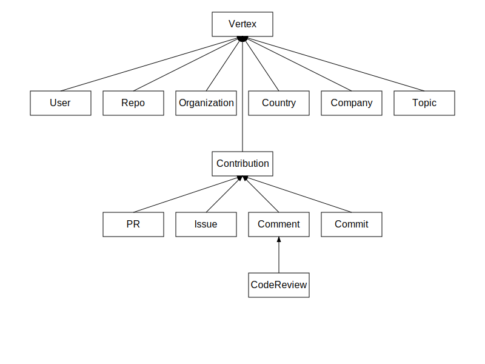

# Development Manual

## 1. Introduction
**OSGraph (Open Source Graph)** provides six open-source graph datasets for users to explore, including three project-related graphs (Contribution, Ecosystem, Community) and three development-related graphs (Activities, Partners, Interests). If these six graphs do not meet your needs, you can customize your own graphs following this document.

## 2. Local Setup
Refer to the [Quick Start](./quick-start.md) document to complete the local setup and testing of the OSGraph service.

## 3. Project Structure

* Entry Point: `osgraph-service/server.py`
* Interface Layer: `osgraph-service/app/routes`
* Business Layer: `osgraph-service/app/managers`
* Service Layer: `osgraph-service/app/services`
* Data Layer: `osgraph-service/app/dal`

## 4. Development Details

### 4.1 Interface Layer Development

#### 4.1.1 Interface Design Specifications

URLs in the interface layer follow standardized design principles, using consistent formats for RESTful APIs, shared pages, and shared images.

| Type  | Example URL                                             |
|-----|------------------------------------------------|
| API | /api/graphs/:graph/:platform/org/repo?:param* | 
| Page  | /graphs/:graph/:platform/org/repo?:param*     | 
| Image  | /png/graphs/:graph/:platform/org/repo?:param* | 

An example of the API's standardized format:


For instance, the URL for the TuGraph DB "Project Contribution" graph:
```
https://osgraph.com/api/graphs/project-contribution/github/TuGraph-family/tugraph-db?start-time=1&end-time=1733717926&repo-limit=10
```

#### 4.1.2 Adding New Graph Interfaces

Create a new graph interface in the `osgraph-service/app/routes` directory and call the corresponding manager for implementation.

```Python
# common url prefix
os_interest_bp = Blueprint("os_interest", __name__, url_prefix="/api/graphs")

# graph api format
@os_interest_bp.route("/os-interest/<platform>/<path:remaining_path>", methods=["GET"])
def get_os_interest(platform, remaining_path):
    ...
    response = controller.get_interest_graph(data)
    ...

# use manager to implement api
class OSInterestController:
    def get_interest_graph(self, data: Dict[str, Any]) -> Dict[str, Any]:
        ...
        graph = self.manager.get_graph(data)
        ...
```

### 4.2 Business Layer Development

#### 4.2.1 Graph View Model

Basic structure of a vertex:：

| Class Name | Attribute | Description |
| --- | --- | --- |
| `Vertex` | `id` | Unique identifier for the vertex |
|  | `name` | Name of the vertex |
|  | `comment` (optional) | Comment about the vertex |
|  | `source` (optional) | Source of the vertex |
|  | `size` (optional) | Size of the vertex |
|  | `vertex_type` | Type of the vertex (class name) |
|  | `to_dict` | Method to convert vertex to dictionary |

Inheritance hierarchy of vertex models: 



The basic structure of an edge model:

| Class Name | Attribute | Description |
| --- | --- | --- |
| `Edge` | `source` | Source node of the edge |
|  | `target` | Target node of the edge |
|  | `id` | Unique identifier for the edge |
|  | `name` | Name of the edge |
|  | `name_en` | English name of the edge |
|  | `direction` (default: "out") | Direction of the edge ("both", "out", "in") |
|  | `comment` (optional) | Comment about the edge |
|  | `weight` (optional) | Weight of the edge |
|  | `count` (optional) | Count of the edge |
|  | `edge_type` | Type of the edge (class name) |
|  | `to_dict` | Method to convert edge to dictionary |

Meaning of edge models:

| Edge Type                 | Description                                                  |
|---------------------|----------------------------------------------------------|
| `Create` | A user creates a new repository                          |
| `CreatePR` | A user initiates a new pull request                      |
| `CreateIssue` | A user creates a new issue                               |
| `CreateCommit` | A user makes a new commit                                |
| `CreateComment` | A user posts a new comment                               |
| `CreateCR` | A user initiates a new code review                       |
| `CodeReviewAction` | A user participates in code review activities            |
| `Belong` | ownership relationship                                   |
| `Star` | A user stars a repository                                |
| `PullRequestAction` | A user performs a pull request                           |
| `Push` | A user pushes code to a repository                       |
| `OpenPR` | A user opens a pull request                              |
| `CommitAction` | A user performs a code commit                            |
| `CommentIssue` | A user comments on an issue                              |
| `CommonIssue` | Issues that users collaboratively participate in         |
| `CommonPR` | Pull requests that users collaboratively work on         |
| `CommonStar` | Repositories that users commonly star                    |
| `CommonRepo` | Repositories that users collaboratively work on          |
| `CommonDevelop` | Development activities that users jointly participate in |
| `ContributeRepo` | A user contributes to a repository                       |

#### 4.2.2 Adding New Graph Managers

Create a manager in the `osgraph-service/app/managers` directory and call the respective service for implementation.

```python
class OSInterestManager:
    def get_graph(self, data: Dict[str, Any]) -> Union[Dict, None]:
        ...
        result = service.execute(data=data)
```


### 4.3 Service Layer Development


#### 4.3.1 Adding New Graph Services

Create a new service in the `osgraph-service/app/services/graph_services` directory.

Configure the required service parameters. Use inputTypes to declare the main query type and filterKeys to define query parameters for the service.

```Python
class OSInterestServiceConfig(ServiceConfig):
    def __init__(self):
        super().__init__(
            name="Open-Source Interest",
            comment="Discover individual open-source interests: Analyze the developer's technical domain and interests based on the themes and tags of the projects participated in.",
            inputTypes=["user"],
            filterKeys=[
                FilterKey(key="topic-limit", type="int", default=3, required=False),
                FilterKey(key="repo-limit", type="int", default=3, required=False),
            ],
        )
```

Register the graph service in `osgraph-service/app/services/__init__.py.`

```Python
SERVICE_CONFIGS = [
    ...
    OSInterestServiceConfig()
]
```

Implement the `execute` function and call the data layer `GraphClient` to fetch the required base graph data.

```Python
class OSInterestService(BaseService):
    def execute(self, data: Dict[str, Any]) -> Any:
        ...
        result = self.graphClient.run(cypher)
```


### 4.4 Data Layer Development

#### 4.4.1 Graph Data Schema

The underlying graph schema for OSGraph is defined as follows:


For details, you can visit the TuGraph console directly: [Link](http://127.0.0.1:7070/#/Workbench/CreateLabel)


## 5. Development Example

### 5.1 Requirement
Build a "Development Language" graph to describe the programming languages a user prefers when contributing to open source.

### 5.2 Develop DevLangController

```python
dev_lang_bp = Blueprint("dev_lang", __name__, url_prefix="/api/graphs")
class DevLangController:
    def __init__(self):
        self.manager = DevLangManager()

    def get_graph(self, data: Dict[str, Any]) -> Dict[str, Any]:
        graph = self.manager.get_graph(data)
        ...

controller = DevLangController()

@dev_lang_bp.route("/dev-lang/<platform>/<path:remaining_path>", methods=["GET"])
def get_org_repo(platform, remaining_path):
    ...
    response = controller.get_graph(data)
```

### 5.3 Develop DevLangManager

```Python
class DevLangManager:
    def get_graph(self, data: Dict[str, Any]) -> Union[Dict, None]:
        service = DevLangService()
        graph = Graph()
        results = service.execute(data=data)
        lang_limit = data["lang-limit"]
        
        lang_names = []
        for (push_edge, lang_results) in results:
            user_node = push_edge.get('start')
            for lang_edge in lang_results:
                lang_names.append(lang_edge.get('end').get('properties')['name'])
        if len(lang_names):
            language_names = [item[0] for item in Counter(lang_names).most_common(int(lang_limit))]
        
            for lang_name in language_names:
                user = User(id=user_node.get('properties')['id'], name=user_node.get('properties')['name'])
                dev_lang = DevLang(id=lang_name, name=lang_name)
                graph.insert_entity(user)
                graph.insert_entity(dev_lang)
                use_edge = Use(source=user, target=dev_lang, id=uuid4())
                graph.insert_relationship(use_edge)
            return graph.to_dict()
```

### 5.4 Develop DevLangService

Configure the DevLangService service parameters.
```python
class DevLangServiceConfig(ServiceConfig):
    def __init__(self):
        super().__init__(
            name="Development Language",
            comment="Discover distribution of individual development language: Analyze the developer's programing language distribution based on the language of the projects participated in.",
            inputTypes=["user"],
            filterKeys=[
                FilterKey(key="lang-limit", type="int", default=5, required=False),
            ],
        )
```

Implement the DevLangService service logic.

```python
class DevLangService(BaseService):
    def __init__(self):
        super().__init__(DevLangServiceConfig())
        
    def execute(self, data: Dict[str, Any]) -> Any:
        validated_data = self.validate_params(data)
        input:str = self.inputTypes[0]
        path: str = validated_data["path"]
        platform: str = validated_data["platform"]
        lang_limit: int = validated_data["lang-limit"]
        es = ElasticsearchClient()
        query = {"match": {"name": path}}
        res = es.search(index=f"{platform}_{input}", query=query, size=1)
        
        if len(res):
            user_id = res[0]["id"]
            github_user = GitHubUser(GitHubUserProps(id=user_id))
            github_repo = GitHubRepo(GitHubRepoProps())
            push_edge = Push(source=github_user, target=github_repo)
            push_results = self.graphClient.get_edge(edge_instance=push_edge, deep=1)
            
            results = []
            for push in push_results:
                end_node = push.get('end')
                repo = GitHubRepo(GitHubRepoProps(id=end_node['properties']['id']))
                lang = Language(LanguageProps())
                use_lang_edge = UseLang(source=repo, target=lang)
                lang_results = self.graphClient.get_edge(edge_instance=use_lang_edge, deep=1, limit=lang_limit)
                results.append((push, lang_results))
                
            return results
```

Register the DevLangService graph service.

```python
SERVICE_CONFIGS = [
    ...
    DevLangServiceConfig()
]
```

### 5.5 Validation

Test the URL：http://127.0.0.1:8000/api/graphs/dev-lang/github/:user-name?lang-limit=3


## 6. Contribution
If you'd like to share your developed graph service with the community, feel free to submit a pull request to our repository. After the version is released, we will publish your service on our official website, enabling more open-source users to use it online.