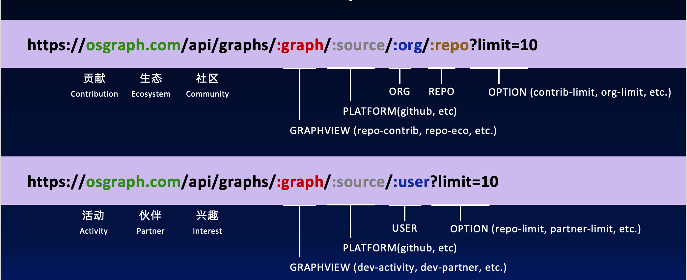

## 1. 介绍
**OSGraph (Open Source Graph)** 默认提供了6张开源数据图谱供大家体验，包含项目类图谱3个（贡献、生态、社区）、开发类3个（活动、伙伴、兴趣）。如果这6张图谱不能满足您的需求，您也可以根据此文档，定制属于您自己的图谱。

## 2. 本地启动
请选参考[快速开始](./QuickStart.md)文档完成本地OSGraph服务启动测试。

## 3. 项目结构

* 启动文件：osgraph-service/run.py
* 初始化入口：osgraph-service/app/__init__.py
* 路由（API）：osgraph-service/app/routes
* 业务视图：osgraph-service/app/managers
* 业务服务：osgraph-service/app/service
* 数据库连接：osgraph-service/app/dal


## 4. 开发详解

### 4.1 接口

#### 4.1.1 规范

* 标准结构：


* API 示例：
    “项目贡献”图谱：
    https://osgraph.com/api/graphs/project-contribution/github/TuGraph-family/tugraph-site?start-time=1&end-time=1733717926&repo-limit=10

#### 4.1.2 开发接口

* 在osgraph-service/app/routes目录中创建接口文件。

* 开发接口内容，并指定调用相关manager

```Python
# url_prefix
os_interest_bp = Blueprint("os_interest", __name__, url_prefix="/api/graphs")
logger = logging.getLogger(__name__)

# api
@os_interest_bp.route("/os-interest/<platform>/<path:remaining_path>", methods=["GET"])
def get_os_interest(platform, remaining_path):
    data = request.args.to_dict()
    data["platform"]=platform
    data["path"]=remaining_path
    response = controller.get_interest_graph(data)
```

### 4.2 视图

#### 4.2.1 视图模型

点模型
| 类名 | 属性 | 描述 |
| --- | --- | --- |
| `Vertex` | `id` | 顶点的唯一标识符 |
|  | `name` | 顶点的名称 |
|  | `comment` (可选) | 顶点的注释 |
|  | `source` (可选) | 顶点的来源 |
|  | `size` (可选) | 顶点的大小 |
|  | `vertex_type` | 顶点的类型（类名） |
|  | `to_dict` | 将顶点转换为字典的方法 |


| 子类 | 继承自 |
| --- | --- |
| `User` | `Vertex` |
| `Repo` | `Vertex` |
| `Orgnization` | `Vertex` |
| `Country` | `Vertex` |
| `Company` | `Vertex` |
| `Topic` | `Vertex` |
| `Contibution` | `Vertex` |
| `PR` | `Contibution` |
| `Issue` | `Contibution` |
| `Comment` | `Contibution` |
| `CodeReview` | `Comment` |
| `Commit` | `Contibution` |

边模型
| 类名 | 属性 | 描述 |
| --- | --- | --- |
| `Edge` | `source` | 边的源节点 |
|  | `target` | 边的目标节点 |
|  | `id` | 边的唯一标识符 |
|  | `name` | 边的名称 |
|  | `name_en` | 边的英文名称 |
|  | `direction` (默认: "out") | 边的方向（"both", "out", "in"） |
|  | `comment` (可选) | 边的注释 |
|  | `weight` (可选) | 边的权重 |
|  | `count` (可选) | 边的数量 |
|  | `edge_type` | 边的类型（类名） |
|  | `to_dict` | 将边转换为字典的方法 |

| 子类 | 继承自 | 默认值 |
| --- | --- | --- |
| `Create` | `Edge` | `name="创建", name_en="Create"` |
| `CreatePR` | `Edge` | `name="创建 PR", name_en="Create PR"` |
| `CreateIssue` | `Edge` | `name="创建 Issue", name_en="Create Issue"` |
| `CreateCommit` | `Edge` | `name="创建 Commit", name_en="Create Commit"` |
| `CreateComment` | `Edge` | `name="创建 Comment", name_en="Create Comment"` |
| `CreateCR` | `Edge` | `name="创建 CR", name_en="Create CR"` |
| `CodeReviewAction` | `Edge` | `name="CR", name_en="CR"` |
| `Belong` | `Edge` | `name="属于", name_en="Belong"` |
| `Star` | `Edge` | `name="Star", name_en="Star"` |
| `PullRequestAction` | `Edge` | `name="PR", name_en="PR"` |
| `Push` | `Edge` | `name="推送", name_en="Push"` |
| `OpenPR` | `Edge` | `name="推送 PR", name_en="Open PR"` |
| `CommitAction` | `Edge` | `name="提交", name_en="Commite"` |
| `CommentIssue` | `Edge` | `name="评论 Issue", name_en="Comment Issue"` |
| `CommonIssue` | `Edge` | `name="合作 Issue", name_en="Common Issue"` |
| `CommonPR` | `Edge` | `name="合作 PR", name_en="Common PR"` |
| `CommonStar` | `Edge` | `name="共同关注", name_en="Common Star"` |
| `CommonRepo` | `Edge` | `name="合作项目", name_en="Common Repo"` |
| `CommonDevelop` | `Edge` | `name="共建", name_en="Common Develop"` |
| `ContributeRepo` | `Edge` | `name="贡献项目", name_en="Contribute Repo"` |

#### 4.2.2 构建视图

* 在osgraph-service/app/managers目录中创建文件。

* 调用相关服务，获取数据，构建视图

```python
# 调用服务并获取数据
service = OSInterestService()
result = service.execute(data=data)
```


```python
# 解析数据，构建视图
graph = Graph()
if start_node["type"] == "github_user":
    user = User(id=start_node["id"], name=start_node["properties"]["name"])
    graph.insert_entity(user)
if relationship["type"] == "repo":
    contribute_repo = ContributeRepo(
        source=relationship["src"],
        target=relationship["dst"],
        id=relationship["id"],
        count=relationship["properties"]["count"],
    )
    graph.insert_relationship(contribute_repo)
```


### 4.3 图服务


#### 4.3.1 开发服务

* 在osgraph-service/app/services/graph_services目录中创建对应服务文件

* 定义服务参数

```Python
class OSInterestServiceConfig(ServiceConfig):
    def __init__(self):
        super().__init__(
            name="开源兴趣",
            comment="这是一张开源兴趣图谱",
            inputTypes=["GitHubUser"],
            filterKeys=[
                FilterKey(key="topic-topn", type="int", default=50, required=False),
                FilterKey(
                    key="githubrepo-topn", type="int", default=50, required=False
                ),
            ],
        )
```

* 注册服务

```Python
from app.services.graph_services.os_interest import OSInterestServiceConfig

SERVICE_CONFIGS = [
    OSInterestServiceConfig()
]
def register_all_services():
    with current_app.app_context():
        for config in SERVICE_CONFIGS:
            config.register_service()
```


* 编写execute函数，并调用数dal层，获取数据

```Python
class OSInterestService(BaseService):
    def __init__(self):
        super().__init__(OSInterestServiceConfig())

    def execute(self, data: Dict[str, Any]) -> Any:
        validated_data = self.validate_params(data)
        cpyher = ''
        result = self.graphClient.run(cypher)
        return result
```


### 4.4 图数据库层

### 4.4.1 数据结构


详情可通过：[TuGraph建模页面查看](http://localhost:7070/#/Workbench/CreateLabel)

## 5. Demo

### 5.1 需求
构建一个"组织或用户关注仓库"的图谱

### 5.2 开发接口

```python

org_repo_bp = Blueprint("org_repo", __name__, url_prefix="/api/graphs")
class OrganizationRepoController:
    def __init__(self):
        self.manager = OrgRepoManager()

    def get_graph(self, data: Dict[str, Any]) -> Dict[str, Any]:

        try:
            graph = self.manager.get_graph(data)
            return ResponseHandler.success(graph)
        except InvalidUsage as e:
            logger.error(f"Invalid usage: {str(e)}")
            return ResponseHandler.error(str(e.message), e.status_code)
        except Exception:
            logger.exception("Internal server error")
            return ResponseHandler.error("Internal server error", 500)
controller = OrganizationRepoController()

@org_repo_bp.route("/organization-repo/<platform>/<path:remaining_path>", methods=["GET"])
def get_org_repo(platform, remaining_path):
    data = request.args.to_dict()
    data["platform"]=platform
    data["path"]=remaining_path
    response = controller.get_graph(data)
    return ResponseHandler.jsonify_response(response)
```

### 5.3 定义manager

```Python
class OrgRepoManager:
    def __init__(self) -> None:
        pass

    def get_graph(self, data: Dict[str, Any]) -> Union[Dict, None]:
        service = OrgRepoService()
        graph = Graph()
        result = service.execute(data=data)
        for path in result:
            start_node = path.get('start')
            end_node =path.get('end')
            user = User(id=start_node.get('properties')['id'],name=start_node.get('properties')['name'])
            repo = Repo(id=end_node.get('properties')['id'],name=start_node.get('properties')['name'])
            graph.insert_entity(user)
            graph.insert_entity(repo)
            edges = path.get('relationships')
            for edge in edges:
                star_edge = Star(source=user,target=repo,id=edge.get('element_id'))
                graph.insert_relationship(star_edge)
        return graph.to_dict()
```

### 5.4 开发 service


* 定义参数

```python
class OrgRepoServiceConfig(ServiceConfig):
    def __init__(self):
        super().__init__(
            name="组织或用户关注仓库",
            comment="这是一个组织（用户）关注仓库的图谱",
            inputTypes=["user"],
            filterKeys=[
                FilterKey(key="repo-limit", type="int", default=10, required=False),
            ],
        )
```


* 定义服务

```python
class OrgRepoService(BaseService):
    def __init__(self):
        super().__init__(OrgRepoServiceConfig())
    def execute(self, data: Dict[str, Any]) -> Any:
        validated_data = self.validate_params(data)
        input:str = self.inputTypes[0]
        path: str = validated_data["path"]
        platform: str = validated_data["platform"]
        repo_limit: int = validated_data["repo-limit"]
        es = ElasticsearchClient()
        query = {"match": {"name": path}}
        res = es.search(index=f"{platform}_{input}", query=query, size=1)
        
        if len(res):
            org_id = res[0]["id"]
            user_porps = GitHubUserProps(id=org_id)
            github_user = GitHubUser(user_porps)
            github_repo = GitHubRepo(GitHubRepoProps())
            star_edge = Star(source=github_user,target=github_repo)
            result = self.graphClient.get_edge(edge_instance=star_edge,deep=1,limit=repo_limit)
            return result
```

* 注册图谱服务

```python
# app/services/__init__.py
from app.services.graph_services.org_repo import OrgRepoServiceConfig
SERVICE_CONFIGS = [
    OrgRepoServiceConfig()
]
```

### 5.5 验证

#### 5.5.1 验证图谱注册

* 浏览器输入URL：http://localhost:8000/api/graphs/list

* 返回结果

```json
{
  "data": [
    {
      "comment": "这是一个组织（用户）关注仓库的图谱",
      "filter_keys": "key:repo-limit,type:int,default:10,required:False",
      "input_types": "user",
      "name": "组织或用户关注仓库"
    }
  ],
  "error": null,
  "message": "Success",
  "status": 0
}
```


#### 5.5.2 验证图谱查询

* 浏览器输入URL：http://localhost:8000/api/graphs/organization-repo/github/nikolay?repo-limit=10

* 返回结果

```json
{
  "data": {
    "edges": [],
    "nodes": [],
    "summary": ""
  },
  "error": null,
  "message": "Success",
  "status": 0
}
```


## 贡献
如果您愿意将您开发服务在开源社区分享，就可以向我们的代码仓库提交PR，审核通过后，我们会将您的服务上线到我们官网服务，让更多的开源用户可以在线使用。


