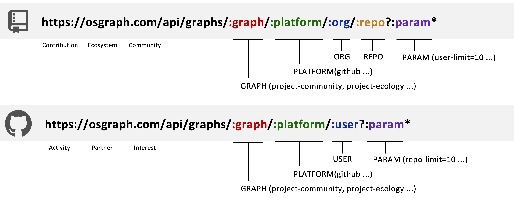

# OSGraph API 文档

OSGraph为基础开源图谱提供了唯一URL标识，方便您的分享、引用和修改，同时支持了Markdown嵌入支持。

当前提供了以下开放URL供大家选择：

| 类型       | 功能         | 备注   |
|----------|------------|------|
| **API**  | 后端集成       |      | 
| **HTML** | 前端嵌入    |      | 
| **PNG**  | Markdown嵌入 |      |
| **SVG**  | Markdown嵌入 | 即将支持 |

## 设计规范

开源图谱URL采用统一的设计规范，通过URL前缀区分特定的功能。

| 类型      | URL前缀  | 项目类URL后缀                                | 用户类URL后缀                           |
|-----------|---------|----------------------------------------------|----------------------------------------|
| **API** | /api    | /graphs/:graph/:platform/:org/:repo?:param*  | /graphs/:graph/:platform/:user?:param* | 
| **HTML**     | -      | /graphs/:graph/:platform/:org/:repo?:param*  | /graphs/:graph/:platform/:user?:param* | 
| **PNG**     | /png    | /graphs/:graph/:platform/:org/:repo?:param*  | /graphs/:graph/:platform/:user?:param* |
| **SVG**     | /svg    | /graphs/:graph/:platform/:org/:repo?:param*  | /graphs/:graph/:platform/:user?:param* |

以API URL为例，其规范化格式为：


如TuGraph DB “项目贡献”图谱URL：
```
https://osgraph.com/api/graphs/project-contribution/github/TuGraph-family/tugraph-db?lang=en-US&repo-limit=10&start-time=2015-01-17&end-time=2025-01-17
```

## 变量说明

URL中变量的具体含义如下：

| 变量         | 含义     | 备注             |
|------------|--------|----------------|
| `graph`    | 图谱类型   | 当前支持6种基础图谱类型   | 
| `platform` | 数据平台来源 | 当前只支持`github`  | 
| `org`      | 组织     |                |
| `repo`     | 仓库     |                |
| `user`     | 用户     |                |
| `param`    | 参数     | 参数列表和`graph`类型相关 |


不同的图谱类型，对应的参数列表支持为：

| 图谱类型               | 含义   | `lang` | `start-time` | `end-time` | `repo-limit` | `user-limit` | `country-limit` | `company-limit` | `topic-limit` |
|--------------------|------|---|--------------|------------|--------------|--------------|-----------------|-----------------|---------------|
| `project-contribution` | 项目贡献图谱 | Y | Y            | Y          | Y            |              |                 |                 |               |
| `project-ecosystem` | 项目生态图谱 | Y | -            | -          | Y            |              |                 |                 |               | 
| `project-community` | 项目社区图谱 | Y | -            | -          |              | Y            | Y               | Y               |               |
| `developer-activity` | 开发活动图谱 | Y | -            | -          |              | Y            |                 |                 |               |
| `os-partner`       | 开源伙伴图谱 | Y | -            | -          |              | Y            |                 |                 |               |
| `os-interest`      | 开源兴趣图谱 | Y | -            | -          | Y            |          |                 |                 | Y             |

注：
* `Y`：已支持
* `-`：待支持
* 默认不支持

