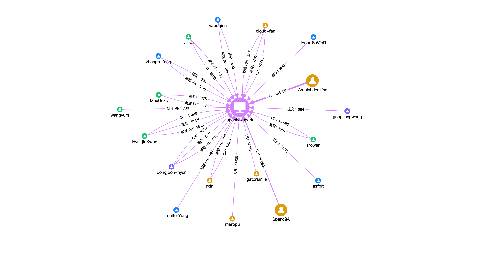
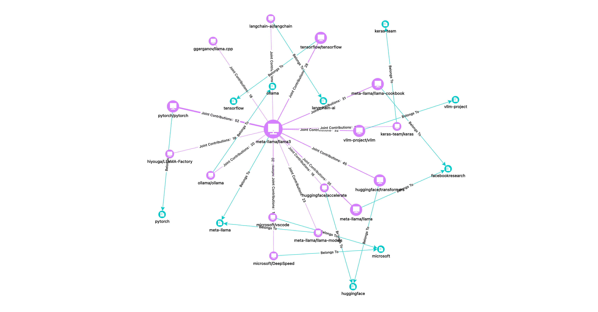
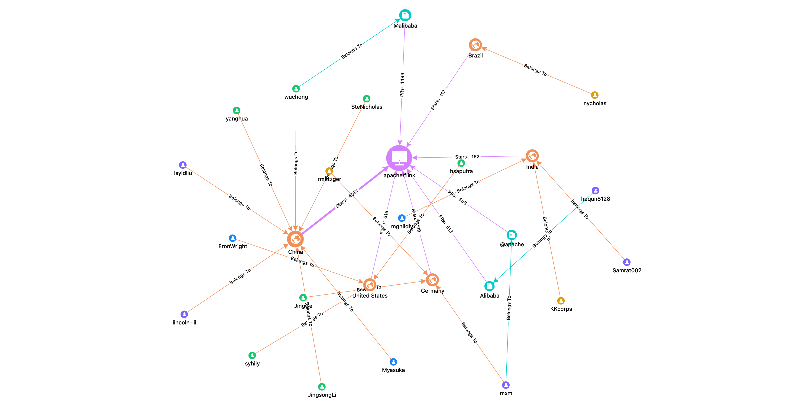
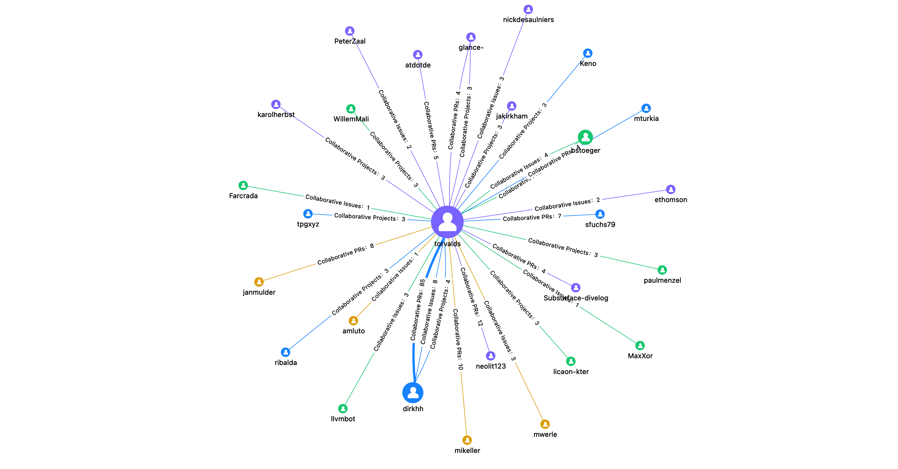
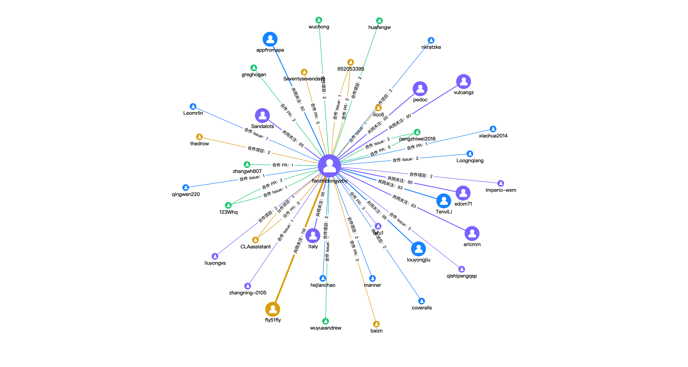

# 图谱示例

当前产品默认提供了6张开源数据图谱供大家体验，包含项目类图谱3个（贡献、生态、社区）、开发类3个（活动、伙伴、兴趣）。

## 1. 项目贡献图谱

**发现项目核心贡献**：根据项目开发者研发活动信息（Issue、PR、Commit、CR等），找到项目核心贡献者。

**Q**：我想看看给Apache Spark项目写代码的都有谁？

**A**：选择“项目贡献图谱” - 搜索spark - 选择apache/spark。可以看到HyukjinKwon、dongjoon-hyun等核心贡献者，另外还一不小心捉到两个“显眼包”，AmplabJenkins、SparkQA这两个只参与CodeReview的机器人账号。

## 2. 项目生态图谱

**洞察项目生态伙伴**：提取项目间的开发活动、组织等关联信息，构建项目核心生态关系。

**Q**：最近很火的开源大模型Llama3周边生态大致是什么样的？

**A**：选择“项目生态图谱” - 搜索llama3 - 选择meta-llama3/llama3。可以看到pytorch、tensorflow、transformers等知名AI项目，当然还有上科技头条的llama.cpp。比较惊喜的发现是ray竟然和llama3有不少公共开发者，可以深度挖掘一下。

## 3. 项目社区图谱

**分析项目社区分布**：根据项目的开发活动、开发者组织等信息，提取项目核心开发者社区分布。

**Q**：大数据引擎Flink发展这么多年后的社区现状如何？

**A**：选择“项目社区图谱” - 搜索flink - 选择apache/flink。可以看到项目关注者主要来自中、美、德三国，而Alibaba组织是代码贡献的中坚力量。

## 4. 开发活动图谱

**展示个人开源贡献**：根据开发者研发活动信息（Issue、PR、Commit、CR等），找到参与的核心项目。

**Q**：大神Linus Torvalds最近在参与哪些开源项目？

**A**：选择“开发活动图谱” - 搜索torvalds。果然linux项目是torvalds的主要工作，不过llvm、mody、libgit2也有所参与，同时也看到他在subsurface这种“潜水日志管理工具”上的大量贡献，果然大佬的爱好都很广泛。

## 5. 开源伙伴图谱

**寻找个人开源伙伴**：找到开发者在开源社区中，与之协作紧密的其他开发者。

**Q**：我想知道在开源社区有没有和我志同道合的人？

**A**：选择“开发伙伴图谱” - 搜索我的ID。让我震惊的是有那么多陌生人和我关注了同一批项目，这不得找机会认识一下，说不定就能找到新朋友了。而和我合作PR的人基本上都是我认识的朋友和同事，继续探索一下朋友们的开源伙伴，开源社区的“六度人脉”不就来了么。

## 6. 开源兴趣图谱

**挖掘个人开源兴趣**：根据参与的项目主题、标签等信息，分析开发者技术领域与兴趣。

**Q**：GitHub上最活跃的开发者对什么技术感兴趣？

**A**：选择“开源兴趣图谱” - 搜索sindresorhus（[GitHub用户榜](https://gitstar-ranking.com) No.1）。整体来看sindresorhus对node、npm、js很感兴趣，另外他发起的awesome项目足足30W星，令人咋舌！当前的开源兴趣数据主要来自项目有限的标签信息，后续借助AI技术可能会有更好的展现。

