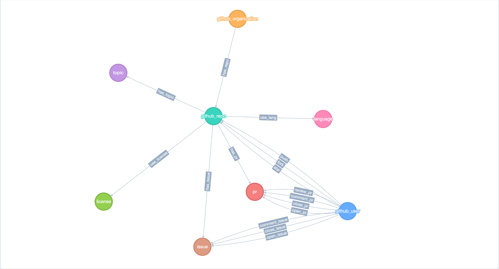

## 1. 介绍
**OSGraph (Open Source Graph)** 默认提供了6张开源数据图谱供大家体验，包含项目类图谱3个（贡献、生态、社区）、开发类3个（活动、伙伴、兴趣）。如果这6张图谱不能满足您的需求，您也可以根据此文档，定制属于您自己的图谱。

## 2. 本地启动
请选参考[快速开始](./quick-start.md)文档完成本地OSGraph服务启动测试。

## 3. 项目结构

* 入口点：`osgraph-service/server.py`
* 接口层：`osgraph-service/app/routes`
* 业务层：`osgraph-service/app/managers`
* 服务层：`osgraph-service/app/service`
* 数据层：`osgraph-service/app/dal`

## 4. 开发详解

### 4.1 接口层开发

#### 4.1.1 接口设计规范

接口层URL采用规范化设计，RESTful API、分享页面、分享图片的URL都采用统一格式。

| 类型  | URL示例                                          |
|-----|------------------------------------------------|
| API | /api/graphs/:graph/:platform/org/repo?:params* | 
| 页面  | /graphs/:graph/:platform/org/repo?:params*     | 
| 图片  | /png/graphs/:graph/:platform/org/repo?:params* | 

如API的规范化格式为：


如TuGraph DB “项目贡献”图谱URL：
```
https://osgraph.com/api/graphs/project-contribution/github/TuGraph-family/tugraph-db?start-time=1&end-time=1733717926&repo-limit=10
```

#### 4.1.2 新增图谱接口

在`osgraph-service/app/routes`目录中创建图谱接口，调用对应Manager完成实现。

```Python
# common url prefix
os_interest_bp = Blueprint("os_interest", __name__, url_prefix="/api/graphs")

# graph api format
@os_interest_bp.route("/os-interest/<platform>/<path:remaining_path>", methods=["GET"])
def get_os_interest(platform, remaining_path):
    ...
    response = controller.get_interest_graph(data)
    ...

# use manager to implement api
class OSInterestController:
    def get_interest_graph(self, data: Dict[str, Any]) -> Dict[str, Any]:
        ...
        graph = self.manager.get_graph(data)
        ...
```

### 4.2 业务层开发

#### 4.2.1 视图层模型

点模型基本结构：

| 类名 | 属性 | 描述 |
| --- | --- | --- |
| `Vertex` | `id` | 顶点的唯一标识符 |
|  | `name` | 顶点的名称 |
|  | `comment` (可选) | 顶点的注释 |
|  | `source` (可选) | 顶点的来源 |
|  | `size` (可选) | 顶点的大小 |
|  | `vertex_type` | 顶点的类型（类名） |
|  | `to_dict` | 将顶点转换为字典的方法 |

各点模型的继承关系如下：


边模型基本结构如下：

| 类名 | 属性 | 描述 |
| --- | --- | --- |
| `Edge` | `source` | 边的源节点 |
|  | `target` | 边的目标节点 |
|  | `id` | 边的唯一标识符 |
|  | `name` | 边的名称 |
|  | `name_en` | 边的英文名称 |
|  | `direction` (默认: "out") | 边的方向（"both", "out", "in"） |
|  | `comment` (可选) | 边的注释 |
|  | `weight` (可选) | 边的权重 |
|  | `count` (可选) | 边的数量 |
|  | `edge_type` | 边的类型（类名） |
|  | `to_dict` | 将边转换为字典的方法 |

各边模型的含义如下：

| 边类型                 | 含义                                                       |
|---------------------|----------------------------------------------------------|
| `Create` | A user creates a new repository                          |
| `CreatePR` | A user initiates a new pull request                      |
| `CreateIssue` | A user creates a new issue                               |
| `CreateCommit` | A user makes a new commit                                |
| `CreateComment` | A user posts a new comment                               |
| `CreateCR` | A user initiates a new code review                       |
| `CodeReviewAction` | A user participates in code review activities            |
| `Belong` | ownership relationship                                   |
| `Star` | A user stars a repository                                |
| `PullRequestAction` | A user performs a pull request                           |
| `Push` | A user pushes code to a repository                       |
| `OpenPR` | A user opens a pull request                              |
| `CommitAction` | A user performs a code commit                            |
| `CommentIssue` | A user comments on an issue                              |
| `CommonIssue` | Issues that users collaboratively participate in         |
| `CommonPR` | Pull requests that users collaboratively work on         |
| `CommonStar` | Repositories that users commonly star                    |
| `CommonRepo` | Repositories that users collaboratively work on          |
| `CommonDevelop` | Development activities that users jointly participate in |
| `ContributeRepo` | A user contributes to a repository                       |

#### 4.2.2 新增图谱管理

在`osgraph-service/app/managers`目录中创建管理器，调用相应Service完成实现。

```python
class OSInterestManager:
    def get_graph(self, data: Dict[str, Any]) -> Union[Dict, None]:
        ...
        result = service.execute(data=data)
```


### 4.3 服务层开发


#### 4.3.1 新增图谱服务

在`osgraph-service/app/services/graph_services`目录中创建对应服务。

配置必要的服务参数，inputTypes声明图谱的查询主体类型，filterKeys声明图谱服务的查询参数。

```Python
class OSInterestServiceConfig(ServiceConfig):
    def __init__(self):
        super().__init__(
            name="Open-Source Interest",
            comment="Discover individual open-source interests: Analyze the developer's technical domain and interests based on the themes and tags of the projects participated in.",
            inputTypes=["user"],
            filterKeys=[
                FilterKey(key="topic-limit", type="int", default=3, required=False),
                FilterKey(key="repo-limit", type="int", default=3, required=False),
            ],
        )
```

在`osgraph-service/app/services/__init__.py`中注册图谱服务。

```Python
SERVICE_CONFIGS = [
    ...
    OSInterestServiceConfig()
]
```

编写execute函数，并调用数据层`GraphClient`，获取所需的底图数据。

```Python
class OSInterestService(BaseService):
    def execute(self, data: Dict[str, Any]) -> Any:
        ...
        result = self.graphClient.run(cypher)
```


### 4.4 数据层开发

#### 4.4.1 图数据Schema

OSGraph底层图数据结构定义为：


详情可访问TuGraph控制台直接查看：[链接](http://127.0.0.1:7070/#/Workbench/CreateLabel)


## 5. 开发示例

### 5.1 需求
构建一个“开发语言”图谱，描述用户开源贡献时偏爱的编程语言。

### 5.2 开发DevLangController

```python
org_repo_bp = Blueprint("org_repo", __name__, url_prefix="/api/graphs")
class DevLangController:
    def __init__(self):
        self.manager = DevLangManager()

    def get_graph(self, data: Dict[str, Any]) -> Dict[str, Any]:
        graph = self.manager.get_graph(data)
        ...

controller = DevLangController()

@org_repo_bp.route("/dev-lang/<platform>/<path:remaining_path>", methods=["GET"])
def get_org_repo(platform, remaining_path):
    ...
    response = controller.get_graph(data)
```

### 5.3 开发DevLangManager

```Python
class DevLangManager:
    def get_graph(self, data: Dict[str, Any]) -> Union[Dict, None]:
        service = DevLangService()
        graph = Graph()
        results = service.execute(data=data)
        lang_limit = data["lang-limit"]
        
        lang_names = []
        for (push_edge, lang_results) in results:
            user_node = push_edge.get('start')
            for lang_edge in lang_results:
                lang_names.append(lang_edge.get('end').get('properties')['name'])

        lang_names = [item[0] for item in Counter(lang_names).most_common(lang_limit)]
        
        for lang_name in lang_names:
            user = User(id=user_node.get('properties')['id'], name=user_node.get('properties')['name'])
            dev_lang = DevLang(id=lang_name, name=lang_name)
            graph.insert_entity(user)
            graph.insert_entity(dev_lang)
            has_edge = Has(source=user, target=dev_lang)
            graph.insert_relationship(has_edge)
        return graph.to_dict()
```

### 5.4 开发DevLangService

配置DevLangService服务参数。
```python
class DevLangServiceConfig(ServiceConfig):
    def __init__(self):
        super().__init__(
            name="Development Language",
            comment="Discover distribution of individual development language: Analyze the developer's programing language distribution based on the language of the projects participated in.",
            inputTypes=["user"],
            filterKeys=[
                FilterKey(key="lang-limit", type="int", default=5, required=False),
            ],
        )
```


实现DevLangService服务逻辑。

```python
class DevLangService(BaseService):
    def __init__(self):
        super().__init__(DevLangServiceConfig())
        
    def execute(self, data: Dict[str, Any]) -> Any:
        validated_data = self.validate_params(data)
        input:str = self.inputTypes[0]
        path: str = validated_data["path"]
        platform: str = validated_data["platform"]
        lang_limit: int = validated_data["lang-limit"]
        es = ElasticsearchClient()
        query = {"match": {"name": path}}
        res = es.search(index=f"{platform}_{input}", query=query, size=1)
        
        if len(res):
            user_id = res[0]["id"]
            github_user = GitHubUser(GitHubUserProps(id=user_id))
            github_repo = GitHubRepo(GitHubRepoProps())
            push_edge = Push(source=github_user, target=github_repo)
            push_results = self.graphClient.get_edge(edge_instance=push_edge, deep=1)
            
            results = []
            for push in push_results:
                repo = push.get('end')
                lang = Language(LanguageProps())
                use_lang_edge = UseLang(source=repo, target=lang)
                lang_results = self.graphClient.get_edge(edge_instance=use_lang_edge, deep=1, limit=lang_limit)
                results.append((push, lang_results))
                
            return results
```

注册DevLangService图谱服务。

```python
SERVICE_CONFIGS = [
    ...
    DevLangService()
]
```

### 5.5 验证

#### 5.5.1 验证图谱注册

* 浏览器输入URL：http://localhost:8000/api/graphs/list

* 返回结果

```json
{
  "data": [
    {
      "comment": "这是一个组织（用户）关注仓库的图谱",
      "filter_keys": "key:repo-limit,type:int,default:10,required:False",
      "input_types": "user",
      "name": "组织或用户关注仓库"
    }
  ],
  "error": null,
  "message": "Success",
  "status": 0
}
```


#### 5.5.2 验证图谱查询

* 浏览器输入URL：http://localhost:8000/api/graphs/organization-repo/github/nikolay?repo-limit=10

* 返回结果

```json
{
  "data": {
    "edges": [],
    "nodes": [],
    "summary": ""
  },
  "error": null,
  "message": "Success",
  "status": 0
}
```


## 贡献
如果您愿意将您开发服务在开源社区分享，就可以向我们的代码仓库提交PR，审核通过后，我们会将您的服务上线到我们官网服务，让更多的开源用户可以在线使用。


